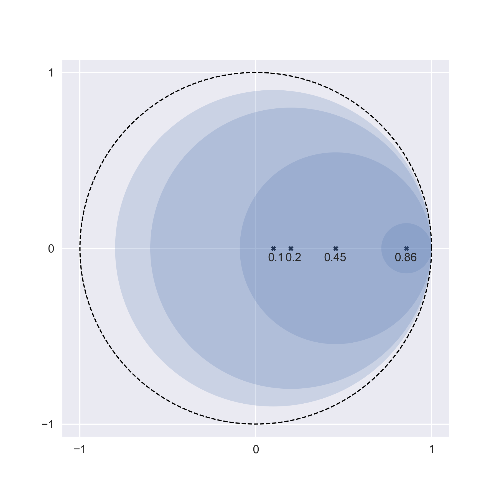

Markov chains are stoachastic models for describing discrete sequences of random behavior.
While I normally dislike probability theory because I find it incredibly confusing, I like Markov chains because they can be expressed using linear algebra (which I find much less confusing!).
This post explores the spectral properties of Markov chains

    The *spectrum* of a matrix is the set of its eigenvalues.
    Spectral properties are then the properties of the eigenvalues that give rise to special behavior.

and relates this to the limiting probabilistic behaviors of Markov chains.

Three main results will be proved in this post (still need to prove #4):

    Said more precisely, Result 2 really characterizes the *dimension of the space of stationary distributions*.

1. The eigenvalues of a Markov chain are bounded within the unit circle
2. The number of stationary distributions a Markov chain has is related to the geometric multiplicity of $$\lambda=1$$
3. A large class of Markov chains have a unique stationary distribution
4. If a Markov chain is not diagonalizable, its stationary distributions are calculable using the Jordan Canonical Form

## Gershgorin and His Circles

A Markov chain describes the probability of transitioning from one state to another.
These transition probabilities can be summarized using a Markov matrix:

**Definition 1 (Markov matrix).**
A matrix $$M \in M_n([0, 1])$$ is a Markov matrix if the entries of each column sum to 1.

    Said another way, if $$i$$ and $$j$$ are states in a Markov chain, then $$\mathbb P( j \mapsto i ) = M_{ij}$$

The eigenvalues of a Markov matrix have a remarkable property: they're never bigger than 1 in magnitude!
To prove this, we need an underrated result from linear algebra:

**Theorem 1 (Gershgorin disc theorem).**
For the $$i$$-th row of a matrix $$A$$,
<!-- let $$G_i(A) = \{ z \in \mathbb C : | z - A_{ii} | \leq R_i \}$$ be a disc centered at $$A_{ii}$$ where the radius is the row sum $$R_i = \sum_{j \neq i} A_{ij}$$. -->
let the row sum $$R_i = \sum_{j \neq i} A_{ij}$$ be the radius of the disc centered at $$A_{ii}$$: $$G_i(A) = \{ z \in \mathbb C : | z - A_{ii} | \leq R_i \}$$.
Let the union of these discs be $$G(A) = \cup_{i=1}^n G_i(A) \,.$$
Then, $$\sigma(A) \subseteq G(A) \,.$$

    Note that $$\sigma(A) = \{\lambda \in \mathbb C : Ax = \lambda x\}$$ represents the set of all eigenvalues of $$A$$.

\
*Proof:* A good explanation is avilable on [Wikipedia](https://en.wikipedia.org/wiki/Gershgorin_circle_theorem#Statement_and_proof).

We can augment the Gershgorin disc theorem with a quick lemma connecting the eigenvalues of $$A$$ and $$A^*$$:

**Lemma 1.**
Given a matrix $$A \in M_n$$, $$\sigma(A) = \sigma(A^*)$$.
\
*Proof:*
The lemma holds since $$A$$ and $$A^*$$ have the same characteristic polynomial:
$$\det(A^*- \lambda I) = \det((A - \lambda I)^*) = \det(A - \lambda I) \,.$$

Thanks to Lemma 1, we can equivalently define $$R_i$$ in the Gershgorin disc theorem to be the *column sum*, $$\sum_{i \neq j} A_{ij}$$, instead of the row sum.
Now, the first main result follows:

**Corollary 1 (Spectrum of Markov matrices).**
The eigenvalues of a Markov matrix $$M \in M_n([0, 1]) \,,$$ are bounded within the unit circle.

    Said mathematically, $$\sigma(M) \subseteq \{ z \in \mathbb C : |z| \leq 1 \} \,.$$

\
*Proof:*
Since the columns of $$M$$ must sum to $$1$$, this means that for every column $$i$$, $$M_{ii} + R_i = 1$$.
Therefore, the disc $$G_i(M)$$ is a subset of the unit circle that also intersects the unit circle at $$(1, 0)$$.
<!-- The same holds for the union of the discs, $$G(M)$$. -->
Therefore, by Theorem 1, $$\sigma(M) \subseteq G(M) \subseteq \{ z \in \mathbb C : |z| \leq 1 \}$$.

Here is an illustration of this proof for a Markov matrix in $$M_4([0,1])$$.

    [This package](https://github.com/v715/gershgorin) can be used to visualize Gershgorin discs of a matrix.

Interestingly, this picture also shows us that the only way we can have an complex eigenvalue with magnitude 1 is if one of the $$M_{ii} = 0$$...
more on this later.

Next, we ask what is the largest eigenvalue of a Markov matrix?

**Corollary 2 (Spectral radius of Markov matrices).**
The spectral radius of a Markov matrix is $$\rho(M) = 1$$ and $$\rho(M) \in \sigma(M)$$.
\
*Proof:*
Let $$\vec{1} \in \mathbb R^n$$ be a column vector of all 1s.
We can then write the column sum constraint as $$M^*\vec{1} = \vec{1}$$.
Note that this equation shows that $$\lambda = 1$$ is an eigenvalue of $$M^*$$ (and by Lemma 1, also an eigenvalue of $$M$$).
Because the eigenvalues of $$M$$ are constrained within the unit circle by Corollary 1,
$$\lambda = 1$$ achieves the maximum possible modulus.
<!-- In fact, the only way another eigenvalue achieves maximum modulus is if $$M_{ii} = 0$$ for some $$i$$. -->
Therefore, $$\rho(M) = 1$$ and $$\rho(M) \in \sigma(M)$$.

## Enumerating the Stationary Distributions

*Remark:*
Gershgorin gives us a very powerful sets of results!
They show that if our Markov matrix is diagonalizable (i.e., $$M = SDS^{-1}$$ for $$S \in M_n$$ invertible and $$D \in M_n$$ diagonal),
then $$M^k = SD^kS^{-1}$$ will converge to some matrix as $$k \to \infty$$,
and the steady state for any initial condition will be determined by the eigenvectors of $$M$$ whose eigenvalues equal the spectral radius.

    What happens if $$M$$ is not diagonalizable?
    In this case, we have to use the Jordan Canonical Form (JCF) of $$M$$ (more on this later).

For a cool application of this convergence idea, let's consider a symmetric Markov chain (i.e., forwards and backwards probability are equal).
The spectral theorem tells us that the eigenvectors of this matrix are orthogonal.
Additionally, assume that the geometric multiplicity of the eigenvector $$1$$ is $$k$$ for this example.
Then,

$$
\begin{align*}
    \lim_{k \rightarrow \infty} M^k
    &= \lim_{k \rightarrow \infty} SD^kS^{-1} \\
    &= S (I_k \oplus \mathbf 0_{n-k}) S^{-1} \\
    &= \begin{pmatrix} s_1 \cdots s_k & \vec 0 \cdots \vec 0 \end{pmatrix}
    \begin{pmatrix} s_1 & \cdots & s_n \end{pmatrix}^* \\
    &= \sum_{i=1}^k s_i s_i^* \,.
\end{align*}
$$

Since the eigenvectors of $$M$$ are orthonormal, note that $$s_i s_i^*$$ is a matrix representing the orthogonal projection onto $$s_i$$.
Thus, $$P_{S_k} = \sum_{i=1}^k s_i s_i^*$$ is a projection matrix onto the span of $$\{s_1, \dots, s_k\}$$.
Finally, we can see that for some initial condition $$x_0$$,

$$ \begin{equation}
    \lim_{k \rightarrow \infty} M^k x_0 = P_{S_k} x_0 \,,
\end{equation} $$

meaning the stationary distributions of $$M$$ are an orthogonal projection onto the eigenspace of $$\lambda = 1$$.
Said another way, any convex combination of the eigenvectors of $$M$$ with eigenvalue $$1$$ is a valid stationary distribution.

So, in general, when does $$M$$ have a unique stationary distribution (i.e., when is the geometric multiplicity of $$1$$ equal to $$1$$)?

## The Perron--Frobenius Theorem

**Definition 3 (Positive and non-negative matrices).**
A matrix $$A \in M_n(\mathbb R)$$ is positive (written $$A > 0$$) if all entries of $$A$$ are positive.
Similarly, if all the entries of $$A$$ are non-negative, then $$A$$ is non-negative as well (i.e., $$A \geq 0$$).

The Perron--Frobenius Theorem gives many results about positive matrices.
To study Markov matrices, we focus on one of them:

**Theorem 2 (Perron--Frobenius).**
If $$A \in M_n(\mathbb R)$$ is positive, then $$\rho(A)$$ is an eigenvalue of $$A$$ with algebraic multiplicity 1.

**Corollary 3.**
Theorem 2 still applies if $$A$$ is non-negative and irreducible.

    Irreducibility is related to the concept of the *connectedness* of a matrix. Specifically, matrices can be represented as *entry digraphs* (take the matrix, binarize it, and treat that as the adjacency matrix of a directed graph). If the graph is strongly connected (i.e., each vertex is connected to every other vertex by a directed edge), then it is irreducible.

By definition, Markov matrices are non-negative.
If a Markov matrix is irreducible, then the Perron--Frobenius theorem says that $$\rho(M)=1$$ is a simple eigenvalue of $$M$$.
Since the geometric multiplicity of an eigenvalue is bounded above by its algebraic multiplicity, that means that there is only a single eigenvector $$x$$ such that $$Ax = x$$.
This vector $$x$$, scaled so that its entries sum to 1, is the unique steady state distribution of $$M$$.

The defintion of irreducibility also helps us understand the result proved in the previous section.
If a matrix is reducible, there are multiple strongly connected components.
These are communities in the graph that, once you walk into, you cannot walk out of.

    You can check out any time you like, but you can never leave.

Such a community would have an eigenvector with non-zero entry for each vertex in the strongly connected component and $$0$$'s for every other vertex, and this eigenvector would be a stationary distribution.
Each strongly connected component would have its own such eigenvector, and their convex hull would be the space of all possible stationary distributions.
This is exactly what we proved in the previous section, but thanks to this spectral graph theory perspective, we now we don't need $$M$$ to be symmetric to prove it!

## Diagonalization with the Jordan Canonical Form

The past results have assumed that $$M$$ is diagonalizable. What if this is not true?

I'm not sure how the math works out really, but I'll endeavor to prove it some day :)

## Future Questions to Answer

These will slowly be addressed in future versions of this post.

- How do we characterize stationary oscillations with spectral methods?
- How does this connect to deterministic discrete linear dynamic systems?
