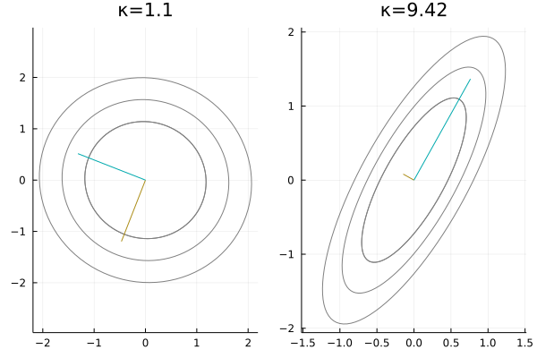

The goals of this post are<span class="sidenote-number"></span>
<span class="sidenote">
    Notes from the Medical Vision Group's summer reading of *Numerical Optimization* by J. Nocedal, Stephen J. Wright, 1999.
</span>

1. To derive the linear conjugate gradient method, and
2. Explain the connection between eigenvalues and the convergence rate.

## Setup

The goal of the linear conjugate gradient algorithm is to iteratively solve linear systems of the form

$$Ax = b \,,$$

where **we assume that $$A \in M_n(\mathbb R)$$ is symmetric positive definite.**<span class="sidenote-number"></span>
<span class="sidenote">
    This may seem to be a strong assumption, but we will soon show how to bypass this for any general rectangular matrix.
</span>
It turns out that solving such a linear system is equivalent to minimizing the quadratic form

$$f(x) = x^TAx - b^Tx + c \,.$$

To see this, look at its gradient:

$$\nabla f(x) = Ax - b \,.$$

The gradient equals zero exactly at the $$x=x^*$$ that minimizes the the residual of the linear system $$r(x^*) = Ax^* - b\,.$$<span class="sidenote-number"></span>
<span class="sidenote">
    We will write that the $$k$$-th iterate $$x_k$$ has a residual of $$r_k = \nabla f(x_k) = Ax_k - b \,.$$
</span>
Additionally, the Hessian matrix of $$f$$ is $$A$$, which is positive definite, so it has exactly one optimum, which is a minumum!

To minimize the quadratic form, we *could* use steepest descent, which is gradient descent where you take the largest step possible to minimize the loss.
However, for certain linear systems, gradient descent converges very slowly (*slowly* here means that the number of steps needed for convergence is $$\gg n$$, the dimension of $$A$$).
Instead, conjugate gradient gives an iterative optimization that is guaranteed to converge in at most $$n$$ steps...<span class="sidenote-number"></span>
<span class="sidenote">
    ...in exact arithmetic -- floating point accuracy means it can take a little longer, but it's still faster than gradient descent.
</span>

## Understanding conjugacy

In essence, the conjugate gradient method is simply a change of basis.
However, the basis we seek is very special:
specifically, we are looking for a set of basis vectors that are *conjugate* with respect to $$A$$.
Two vectors $$u$$ and $$v$$ are conjugate if they satisfy a special kind of orthogonality:

$$ u^T A v = v^T A v = 0 \,.$$

This means that after $$u$$ (or $$v$$) is transformed by $$A$$, it is orthogonal to $$v$$ (or $$u$$).
This basis is very useful for finding the solution to a linear system, as we'll show below.
First, a quick lemma:

### Linear independence of conjugate vectors

**Lemma 1.** If $$u$$ and $$v$$ are conjugate with respect to $$A$$, then they are also linearly independent.
\
*Proof:* Suppose, by way of contradiction, $$u$$ and $$v$$ are not linearly independent. Then, there exists some non-zero constant $$k$$ such that $$u = kv$$. This implies $$0 = u^TAv = kv^TAv \Longrightarrow v^TAv = 0$$. However, this is a contradiction because $$A$$ positive definite means $$v^TAv > 0 \,. $$

By induction, we can also show that a set of conjugate vectors are linearly independent.

### Conjugate directions method

Suppose that we have a conjugate basis $$\{p_1, \dots, p_n\}$$ with respect to $$A$$.
Since these vectors are linearly independent, we can express $$x^*$$ as

$$ x^* = \alpha_1 p_1 + \cdots + \alpha_n p_n \Longrightarrow Ax^* = b = \alpha_1 Ap_1 + \cdots + \alpha_n Ap_n \,. $$

Premultiplying by the vector $$p_k$$, we see that

$$ p_k^T b = \alpha_k p_k^T A p_k \,, $$

since the other terms cancel out by conjugacy! Therefore, we have that the coefficients are

$$ \alpha_k = \frac{p_k^T b}{p_k^T A p_k} \,, $$

which are all quantities we know how to compute. That is, changing our basis to a conjugate one makes it very easy to solve a linear system.

This simple results tells us two important facts:

1. If we have a procedure that produces a conjugate basis vector at each step, we can solve a linear system in at most $$n$$ steps.
2. If we have a set of conjugate basis vectors for $$A$$, it is trivial to solve a linear system. The brilliance of the conjugate gradient method is in how we find these vectors.

### Visualizing conjugate directions and condition number

Before discussing the generating procedure, it's useful to visualize conjugacy and our loss landscape.

Since we are working with positive definite matrices, it's useful to have a function to randomly generate them.
The procedure we use leverages the fact that $$A^T A$$ is gauranteed to be a positive semidefinite matrix (use the definition of positive semidefiniteness to prove this).<span class="sidenote-number"></span>
<span class="sidenote">
    Note that $$A^T A$$ is positive semidefinite if and only if $$\mathrm{rank}(A) < n$$, and the probability of this happening is very small.
</span>
Therefore, we almost always generate a positive definite matrix by samping a random square matrix and premultiplying it by its transpose.

```julia
function random_psd(n::Int64=2)
    A = randn(n, 2)
    return A' * A
end
```

Next, we plot the level sets of the quadratic form defined by our positive definite $$A$$.
That is, we visualize multiple elliptical curves along which $$x^TAx = c$$ for some constant $$c$$.
These let us visualize the loss landscape we are trying to optimize.

The final concept we will discuss with these curves is the **condition number**. The condition number is the ratio between the largest and smallest eigenvalues. When this number is small (i.e., closer to 1), the closer the ellipses are to a circle (*left*). This corresponds to a system that is more amenable to gradient descent: you can pick any direction to descent and make good progress. For a system with a large condition number (*right*), some directions are much more fruitful than others. This means gradient descent can take a very long time if you choose a poor starting point for the optimization.



## Deriving the conjugate gradient method

Here, we derive conjugate gradient as an iterative method.
Note, the first search direction $$p_0 = -r_0$$ since it is the negative gradient.

### Finding the optimal step size $$\alpha_k$$

Assume we start at some point $$x_0$$.
For a set of conjugate directions $$\{p_0, \dots, p_k\}$$, we define the update function as

$$ x_{k+1} = x_k + \alpha_k p_k \,, \quad\quad\text{(Eq. 1)}$$

where $$\alpha_k$$ is the length that optimally descends $$p_k$$.
To find $$\alpha_k$$, we define $$g(\alpha_k) = f(x_k+\alpha_kp_k)$$, so that when

$$
\frac{\partial g}{\partial \alpha_k}
= (x_k + \alpha_kp_k)^TAp_k - b^Tp_k
= x_k^TAp_k + \alpha_kp_k^TAp_k - b^Tp_k
= 0 \,, $$

we have that

$$\alpha_k = \frac{p_k^T(b-Ax_k)}{p_k^TAp_k} = -\frac{p_k^Tr_k}{p_k^TAp_k} \,. $$

### Finding the next search direction $$p_k$$

We define the new search direction as $$p_k = -r_k + \beta_kp_{k-1}$$.
Premultiplying by $$p_{k-1}^TA$$ yields

$$ p_{k-1}^TAp_k = -p_{k-1}^TAr_k + \beta_kp_{k-1}^TAp_{k-1} \,, $$

where the LHS cancels to zero because of conjugacy.
Solving for $$\beta_k$$ yields

$$ \beta_k = \frac{p_{k-1}^TAr_k}{p_{k-1}^TAp_{k-1}} \,. $$

With this, we can implement the most basic version of conjugate gradient.

```julia
function slow_conjgrad(
    A::Matrix{Float64},  # Constraint matrix
    b::Vector{Float64},  # Target
    x::Vector{Float64};  # Initial guess
    tol::Float64=10e-6   # Tolerance for early stop criterion
)
    k = 1
    r = A * x - b
    p = -r
    while norm(r) > tol
        Ap = A * p  # Avoid recomputing a matrix-vector product
        α = -(r' * p) / (p' * Ap)
        x = x + α * p
        r = A * x - b
        β = (r' * Ap) / (p' * Ap)
        p = -r + β * p
        k += 1
    end
    return x, k
end
```
